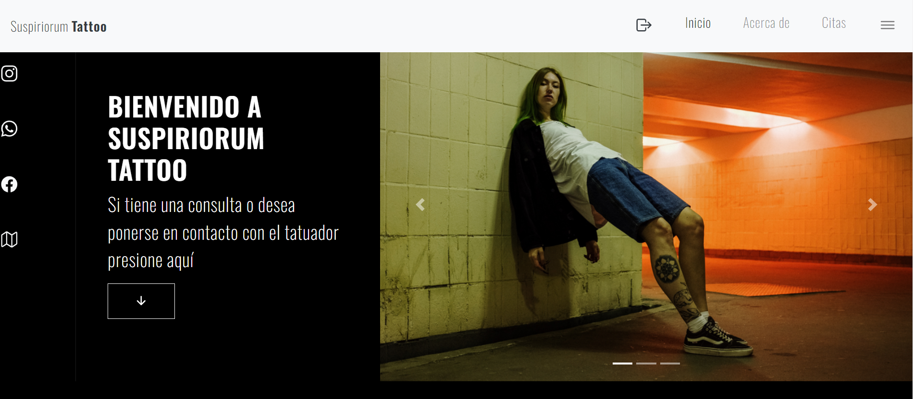

# 🖋️ Sitio Web – Tattoo Artist

Sitio web informativo desarrollado para un tatuador profesional con el objetivo de fortalecer su presencia digital y mostrar su portafolio artístico.

---

## 🌐 Demo en vivo

🔗 https://TU-LINK-AQUI.com

---

## 📸 Vista previa

---

## 🎨 Tecnologías utilizadas

- HTML5
- CSS3
- Bootstrap
- JavaScript

---

## ✨ Características

✔ Diseño moderno y visualmente atractivo  
✔ Formulario de contacto  
✔ Sección "Sobre el artista"  
✔ Información de contacto  
✔ Diseño completamente responsive  

---

## 🧠 Objetivo del proyecto

Crear una plataforma visual que transmita el estilo artístico del tatuador y facilite el contacto con potenciales clientes.

---

## 📚 Aprendizajes

- Diseño orientado a marca personal
- Uso de tipografías y paletas oscuras
- Creación de formulario funcional.
- Diseño responsive enfocado en experiencia visual

---

## 👨‍💻 Autor

**Kendall Campos Ramírez**

- 💼 Portafolio: https://TU-PORTAFOLIO
- 🐙 GitHub: https://github.com/TU-USUARIO
- 💼 LinkedIn: https://www.linkedin.com/in/kendall-campos-ram%C3%ADrez-b19416268/
